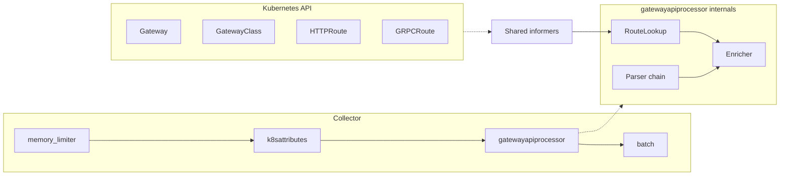

# Architecture

`gatewayapiprocessor` is a single Go component shared across the traces, logs,
and metrics pipelines. A single instance keeps one set of informer caches and
one parser chain so the Kubernetes API is watched exactly once per collector
process, regardless of how many signals are enriched.

## Component layout

- `memory_limiter` is always first, `batch` is always last &mdash; collector
  invariants.
- `k8sattributes` runs before `gatewayapiprocessor` so pod and workload
  metadata are already on the record when enrichment runs.

## Signal flow

On every ConsumeTraces / ConsumeLogs / ConsumeMetrics call:

1. **Parser chain match.** For each record, the parser chain is walked in the
   configured order. Each parser receives the record's attributes and the
   controller identity it knows how to match. The **first parser that returns
   a non-empty `(namespace, name)` tuple wins**. If no parser matches and the
   chain ends with `passthrough`, the raw string is written to
   `k8s.gatewayapi.raw_route_name` and the record passes through unmodified
   otherwise.
2. **RouteLookup.** The winning `(namespace, name)` is looked up in the
   informer-backed `RouteLookup`. This returns the HTTPRoute (or GRPCRoute)
   object, its resolved parent Gateway, and the matching GatewayClass.
3. **Enrichment.** The [Attribute contract](index.md#attribute-contract) is
   written to the record. On the metrics pipeline, attributes listed in
   `enrich.exclude_from_metric_attributes` are stripped right before emit.
4. **Status conditions.** When `emit_status_conditions: true`,
   `k8s.httproute.accepted` and `k8s.httproute.resolved_refs` are stamped from
   the HTTPRoute status subresource's `Accepted` and `ResolvedRefs`
   conditions. The same logic applies to GRPCRoute, stamping
   `k8s.grpcroute.accepted` and `k8s.grpcroute.resolved_refs` from the
   GRPCRoute status subresource.

## Parser chain

Parsers are configured as an ordered list. The chain is an explicit contract:

- **`envoy`** &mdash; parses an opaque `route_name` attribute via a named-
  capture regex. Default regex handles
  `httproute/<ns>/<name>[/rule/<rule>][/match/<match>]`. The `ns` and `name`
  capture groups are required; `rule` and `match` are optional and stamp
  `k8s.httproute.rule_index` / `k8s.httproute.match_index` when present.
- **`linkerd`** &mdash; reads discrete Linkerd label attributes (`route_name`,
  `route_kind`, `route_namespace`, `parent_name`) and derives the HTTPRoute
  identity from them.
- **`passthrough`** &mdash; catch-all. Writes the raw source attribute value to
  a configurable key (`k8s.gatewayapi.raw_route_name` by default) and returns
  an empty match so the record falls out of enrichment. Must be **last** in
  the chain; config validation rejects any other placement.

A parser may declare a list of `controllers` regex patterns. These are
matched against `GatewayClass.spec.controllerName`; empty list means "match
any". The processor stamps `k8s.gatewayapi.parser` with the name of the
parser that resolved the record, which is the fastest way to verify the
chain is routing traffic as intended.

## Informers

When `auth_type` is `serviceAccount` or `kubeConfig`, the processor starts a
set of shared informers against:

- `gateway.networking.k8s.io/v1` &mdash; `Gateway`, `HTTPRoute`, `GRPCRoute`, `GatewayClass`.

Scoping is controlled by `watch.namespaces`. An empty or null list means
cluster-wide; any non-empty list narrows the informer factory to the listed
namespaces. `watch.resync_period` sets the informer's periodic resync; the
default `5m` is a compromise between responsiveness to status changes and
load on the Kubernetes API.

At startup, `Start()` blocks for up to `informer_sync_timeout` (default
`30s`) waiting for the informer caches to warm up. If the caches never sync
within that window, the component returns an error and the collector fails
its readiness probe.

When `auth_type: none`, no informers are started. Only string-only parsing
runs &mdash; Gateway and HTTPRoute lookups return empty and no status
conditions are emitted.

## Metrics cardinality guard

The default `enrich.exclude_from_metric_attributes` list strips three
attributes before metrics are emitted:

- `k8s.httproute.uid`
- `k8s.gateway.uid`
- `k8s.gatewayapi.raw_route_name`

These are the known high-cardinality fields: UIDs rotate per object lifetime,
and the raw route name carries rule/match indices that blow up cardinality
when combined with other dimensions. Customize this list via config when you
want a tighter or looser guard; see [Examples](examples.md#tighter-metrics-cardinality-guard).

## BackendRef fallback

When enabled (default), the processor applies a best-effort enrichment path
when no HTTPRoute match is resolved. It reads a configurable attribute
(default `server.address`, commonly set by `k8sattributes`) and resolves it
against the informer's backend-to-route index. The fallback only fires when
the primary lookup fails, and it is a best-effort signal &mdash; records enriched
this way do **not** receive `k8s.httproute.accepted` /
`k8s.httproute.resolved_refs` (or the GRPCRoute equivalents).

## Failure modes

- **Gateway API CRDs missing.** Informer caches fail to sync;
  `informer_sync_timeout` elapses and `Start()` returns an error.
- **Partial RBAC.** Missing `list/watch` on any of the four resource kinds
  causes the corresponding informer to error; the component logs the failure
  via the collector's structured logger and the affected enrichment path
  (for example, GRPCRoute lookups) returns empty.
- **No parser matches.** If `passthrough` is not configured, the record is
  emitted unchanged; no Gateway API attributes are stamped. With `passthrough`
  configured, the raw string is stamped on
  `k8s.gatewayapi.raw_route_name` (excluded from metrics by default).
- **Regex misconfiguration.** Caught at config validation time. The component
  refuses to build if a `controllers` entry or an `envoy` `format_regex` does
  not compile, or if the `envoy` regex is missing the `ns` or `name` named
  group.
