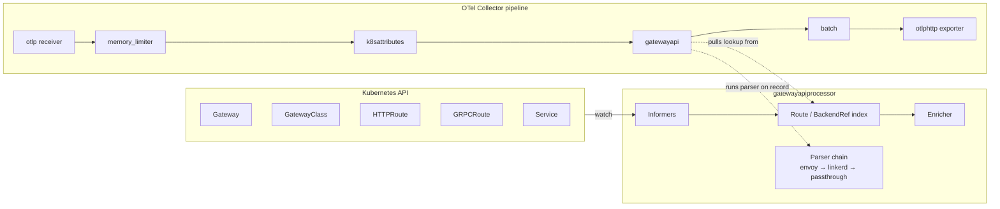

# How it works

This page is the architecture tour. It pairs with [processor-spec §2](https://paperclip.isitobservable.com/ISI/issues/ISI-670#document-processor-spec) — if they ever disagree, the spec wins.

## Data flow



## Informer startup

`Start()`:

1. Build a `gateway.networking.k8s.io/v1` clientset using the configured auth (`serviceAccount` / `kubeConfig` / `none`).
2. Start four shared informers — `Gateway`, `HTTPRoute`, `GRPCRoute`, `GatewayClass` — once per configured namespace scope.
3. Wait for all four caches to sync. The wait is bounded by `informer_sync_timeout` (default 30s). If any cache fails to sync (usually RBAC), `Start()` returns a clear error and the collector doesn't come up.
4. Build two secondary indexes:
    - `routeKey → HTTPRoute` where `routeKey` is `"<namespace>/<name>"` — the hot path for Envoy/Kgateway/Linkerd parsed output.
    - `backendServiceKey → []HTTPRoute` where `backendServiceKey` is `"<ns>/<service>"` — used by `backendref_fallback`.

Cache updates are event-driven. The `resync_period` (default 5m) is a safety net that triggers a full re-list — not the primary update mechanism.

## Per-signal processing

For each span / log record / metric data point:

1. Walk the parser chain in order. The first parser that returns `(namespace, name)` wins.
2. Look up the HTTPRoute/GRPCRoute in the route index. On miss, stamp `k8s.gatewayapi.raw_route_name` + `k8s.gatewayapi.parser=passthrough` and move on.
3. Look up the parent `Gateway` via `spec.parentRefs[0]`. Look up the `GatewayClass` via `Gateway.spec.gatewayClassName`. Stamp `k8s.gateway.*` and `k8s.gatewayclass.*`.
4. If `emit_status_conditions=true`, stamp `k8s.httproute.accepted` / `k8s.httproute.resolved_refs` from the informer-cached conditions (no extra API call).
5. If the signal is a metric, strip any attribute listed in `enrich.exclude_from_metric_attributes` **before** handing the record to the next processor.

The parser chain and the route index are both pure in-memory operations — the processor adds negligible latency compared to network egress on batch.

## Single-owner route index

A single `(namespace, name)` pair can be referenced by multiple `backendRefs`. The route index is keyed by the **HTTPRoute's own identity** (`namespace/name`), not by any backendRef, so lookups stay O(1) and deterministic.

Contrast with the **backendRef fallback index**, which is keyed by `namespace/service` and may return multiple HTTPRoutes. When that happens, the processor picks the first indexed match and stamps `k8s.gatewayapi.parser=backendref_fallback` so the ambiguity is visible. See [Troubleshooting → Ambiguous attribution](../troubleshooting/index.md#ambiguous-attribution).

## Cardinality guard

The metrics pipeline runs the same enrichment but strips any attribute listed in `enrich.exclude_from_metric_attributes` before emitting. Defaults:

- `k8s.httproute.uid` — grows per HTTPRoute recreation.
- `k8s.gateway.uid` — grows per Gateway recreation.
- `k8s.gatewayapi.raw_route_name` — high-cardinality opaque string; not useful as a metric dimension.

The guard is applied at the record level, not globally — you can keep UIDs on traces/logs and still strip them on metrics.

## BackendRef fallback

When a span has no recognizable `route_name` but does carry a server-side address (e.g. `server.address=api-service.demo.svc.cluster.local`), the fallback walks the `backendServiceKey` index and picks the first HTTPRoute whose `backendRefs` include that Service.

This is **probabilistic** — if two HTTPRoutes both route to `api-service`, the fallback attributes to the first indexed one. The record is tagged `k8s.gatewayapi.parser=backendref_fallback` so operators can tell when attribution is ambiguous.

Disable in strict clusters:

```yaml
processors:
  gatewayapi:
    backendref_fallback:
      enabled: false
```

## Shutdown

`Shutdown()` cancels the informer context, waits for the informer goroutines to exit, and returns within the collector's graceful shutdown window. The processor does not persist state — a restart rebuilds the route index from a fresh list.

## Memory footprint

A single cached HTTPRoute costs ~2 KB. 1 000 routes ≈ 2 MB. This is negligible compared to `k8sattributesprocessor` (which caches entire Pods) and has never been the hot object in a production trace.

## See also

- [Configuration](../configuration/index.md)
- [Attribute reference](../attribute-reference/index.md)
- [Troubleshooting](../troubleshooting/index.md)
